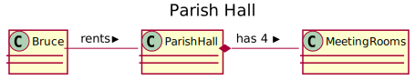

PlantUML
========

PlantUML is an open source tool to create UML diagrams from plain text.
It is responsible for layout - leaving you to concentrate on the 
relationships you are modeling!

It can be installed by most Unix package managers or downloaded from 
[PlantUML.org](plantuml.org).

Invoking
--------

    plantuml -tsvg input-test
    
Sequence Diagram
----------------
    
    @startuml
    title Do NOT kick cats!
    actor "Angry Man" as perp
    actor "Innocent Cat" as cat
    actor "Concerned Citizen" as citizen
    actor "Policeman" as popo
    perp -> cat : kicks
    citizen -> perp : observes
    citizen -> popo : reports
    popo -> perp : arrests
    @enduml

Activity Diagram 
----------------

    @startuml
    title Waiting for Winter Tech Forum
    start
    if (WTF in session?) then (yes)
      :Learn and have fun!;
    else (no)
      :Chat on WTF slack channel;
    endif
    stop
    @enduml

Class Diagram
-------------
    
    @startuml
    title Parish Hall
    class ParishHall
    Bruce - ParishHall : rents >
    ParishHall  *- MeetingRooms : has  4 >
    @enduml
    

